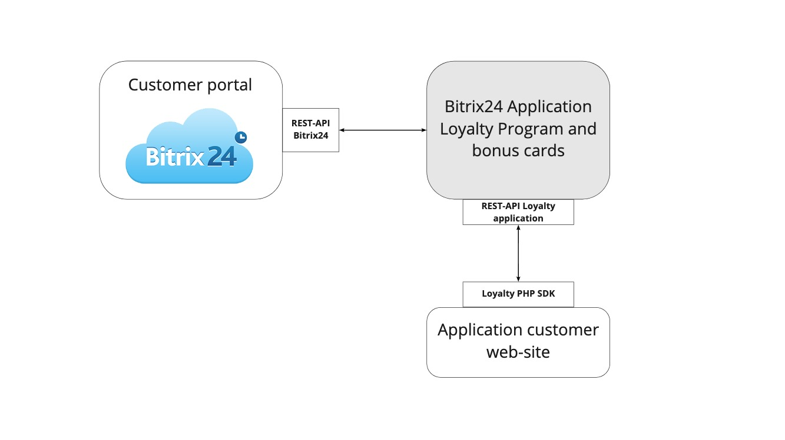

# loyalty-php-sdk
[](https://packagist.org/packages/b24io/loyalty-php-sdk) [](https://packagist.org/packages/b24io/loyalty-php-sdk)

Loyalty PHP SDK is a tool for work with REST-API Bitrix24 Application [Loyalty Program and bonus cards for Bitrix24 CRM](https://www.bitrix24.ru/apps/?app=b24io.loyalty)

* Loyalty app adds bonus card for Bitrix24 client profile in CRM
* Loyalty app support transactions for payment and accrual operations
* store percentage of discount
* operations with cards: create, read, delete, block

## Documentation
* [REST-API documentation on swaggerhub](https://app.swaggerhub.com/apis-docs/b24io/b24loyalty/)
* [Instruction and FAQ in russian](https://loyalty.click/ru/loyalty-program-in-bitrix24-step-by-step-guide/)
 
## Who uses loyalty PHP SDK
* B2C companies who works with customers and grow they LTV
* HoReCa companies such us fast food or restaurants

## How it works
<p align="center">
  
</p>

## Domain entities
In loyalty-php-sdk available domain entities from application with DTO (data transfer objects).  

### Cards
Loyalty card object:
* `number` - card number
* `barcode` - card barcode
* `status` - card status enumeration (active, blocked or deleted)
* `user` - card owner user id 
* `balance` - card balance with php-money object
* `percentage` - card percentage
* `created` - card date create
* `modified` - card date modified
* `uuid` - card [universally unique identifier](https://en.wikipedia.org/wiki/Universally_unique_identifier)

### Transactions
Transactions - accrual or payment operation with card balance

Transaction object:

* `value` - transaction amount with php-money object
* `operationId` - internal operation id, read only
* `type` - payment or accrual transaction
* `cardNumber` - card number
* `created` - transaction date create
* `reason` - transaction reason with comment  

### Turnovers
Turnover object:

* `modified` - last operation date
* `totalPurchasesSum` - total purchases sum for card
* `totalPurchasesCount` - total purchases count for card

### OperationsJournal
Operations journal with card - it's read only log with card state history

Operation objects implements operation interface:

* `Uuid` - operation uuid
* `OperationType` - enumeration of operation types ()
* `CardUuid` - card uuid 
* `UserId` - user id
* `Timestamp` - operation timestamp
* `Reason` - operation reason
 
 #### Operation types
* `accrual_transaction` - accrual transaction 
* `payment_transaction` - payment transaction
* `create_card` - card create
* `block_card` - block card
* `unblock_card` - unblock card
* `delete_card` - delete card 
* `decrement_percent` - decrement percent on card 
* `increment_percent` - increment percent on card
* `purchase` - purchase registration 
* `b24_deal_monetary_discount_payment_trx` - Bitrix24 deal partial payment with monetary discount
* `b24_deal_percentage_discount_payment_trx` - Bitrix24 deal partial payment with percentage discount

### Metrics
Metrics describe operational parameters loyalty application

Metric object:
* `uuid` - metric uuid
* `name` - metric name
* `description` - metric description 
* `code` - metric code
* `type` -  metric type enumeration: INTEGER, FLOAT, MONEY, PERCENTAGE
* `created` - metric created date time 

### Bitrix24 Contacts
Bitrix24 Loyalty application do not store contacts, app fetch Bitrix24 contacts in realtime with each API-request.

Contact object:
* `contactId` - Bitrix24 contact id
* `name` - name
* `secondName` - second name 
* `lastName` - last name
* `birthday` - contact birthday
* `comments` - comments about contact
* `created` - contact date create
* `modified` - contact date modified
* `mobilePhone` - contact mobile phone
* `email` - contact personal email
* `address` - contact address 
* `originId` - origin identifier
* `originatorId` - originator identifier
* `utm` - utm labels for contact ads channel tracking
* `sourceDescription` - source description  

## Installation
Via Composer

```bash
$ composer require b24io/loyalty-php-sdk
```

### Requirements
Loyalty PHP SDK works with PHP 7.1 or above, need `ext-json` and `ext-curl` support

## Authentication with admin and user roles
SDK can work with two roles: 
* `admin` - can work with all cards in his Bitrix24 account and loyalty application instance 
* `user` - can work only with his card 

Bitrix24 Application Loyalty Program and bonus cards work with many Bitrix24 accounts, each account has a `CLIENT_API_KEY` 
If you want work in admin role you must use `ADMIN_API_KEY` to sign queries.

```php
$token = new SDK\Auth\DTO\Token(
    SDK\Transport\DTO\Role::initializeByCode('admin'),
    Uuid::fromString('CLIENT_API_KEY'),
    Uuid::fromString('ADMIN_API_KEY')
);
```
If you want work with client role in JS you must use `CLIENT_API_KEY` and `CARD_UUID` as user API key. 

## Basic Usage
```php
use \Monolog\Logger;
use \B24io\Loyalty\SDK;
use Ramsey\Uuid\Uuid;

use GuzzleHttp\HandlerStack;
use GuzzleHttp\Middleware;
use GuzzleHttp\MessageFormatter;

$log = new Logger('loyalty-php-sdk');
$log->pushHandler(new \Monolog\Handler\StreamHandler('loyalty-php-sdk-example.log', Logger::DEBUG));
$guzzleHandlerStack = HandlerStack::create();
$guzzleHandlerStack->push(
    Middleware::log(
        $log,
        new MessageFormatter(MessageFormatter::SHORT)
    )
);
$httpClient = new \GuzzleHttp\Client();

$log->info('loyalty.apiClient.start');
$token = new SDK\Auth\DTO\Token(
    SDK\Transport\DTO\Role::initializeByCode('admin'),
    Uuid::fromString('CLIENT_API_KEY'),
    Uuid::fromString('ADMIN_API_KEY')
);
$apiClient = new SDK\ApiClient($apiEndpoint, $token, $httpClient, $log);
$apiClient->setGuzzleHandlerStack($guzzleHandlerStack);

$cardsTransport = SDK\Cards\Transport\Admin\Fabric::getCardTransport($apiClient, $log);

$cardResponse = $cardsTransport->getCardByNumber(22222);

$decimalMoneyFormatter = new \Money\Formatter\DecimalMoneyFormatter(new \Money\Currencies\ISOCurrencies());
var_dump($cardResponse->getCard()->getNumber());
var_dump($cardResponse->getCard()->getStatus()->getCode());
var_dump($decimalMoneyFormatter->format($cardResponse->getCard()->getBalance()));
var_dump($cardResponse->getCard()->getPercentage()->format());
```
## Documentation and examples
More complex examples and use cases you can see in folder [examples](examples)  

## Submitting bugs and feature requests
Bugs and feature request are tracked on [GitHub](https://github.com/b24io/loyalty-php-sdk/issues)

## Support
* [Telegram chat](https://t.me/joinchat/PhcdgxWKHu7gOGRmowqCpA) with developers
* [app@b24.io](mailto:app@b24.io)  

## Security
If you discover any security related issues, please contact us at [app@b24.io](mailto:app@b24.io)

## License
The MIT License (MIT). Please see [License File](LICENSE) for more information.
